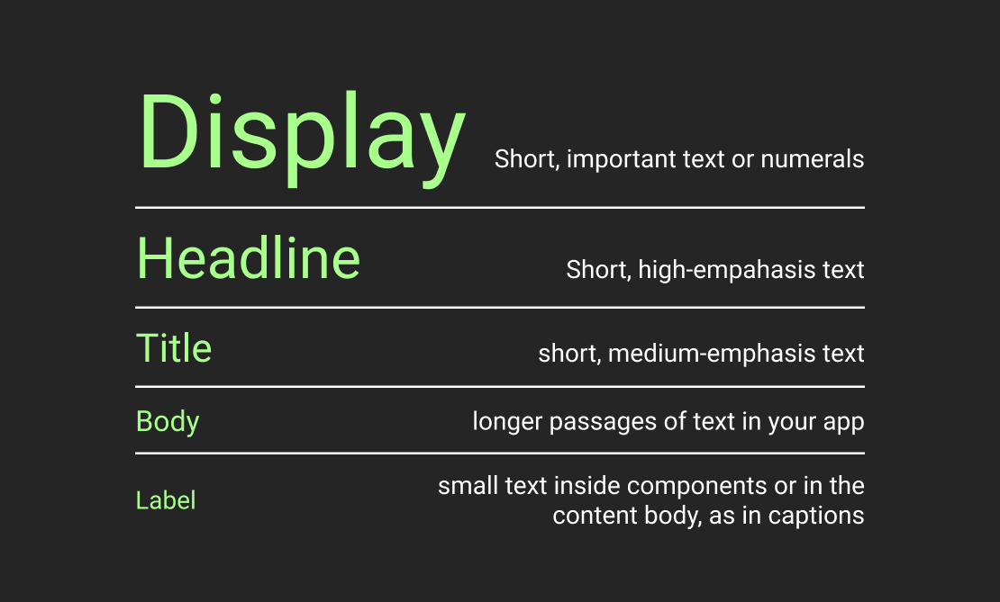

# Material 3 (You) Typography Cheatsheet

Material You helps organizing typography in an app by providing a standard set of 15 typography tokens (or `TextStyle`, as they are called in Fluuter). The tokens are arranged in 5 groups (also referred to as **roles**, styles, and type styles). Each group has exactly 3 elements (called **scales**): Large, Medium, and Small.

In my understanding, the main purpose of the tokens is to bear a semantical meaning. However, the official docs only provide semantic description and usage examples for the **roles**, supposedly, leaving determining semantic of a specific tokens up to us. Besides role semantics, docs also specify default implementation for each token. `Roboto` font family is used for every token. Only `Regular` and `Medium` weights are used. Where `Medium` is slightly bolder then `Regular`. 

This cheatsheet is essentially an attempt to just make the official documentation more readable. I've collected descriptions of role semantics, default token specifications, and example imagery. To my surprise, the official documentation is pretty pure on details. So, although I tried to extract **everything** useful, the article remained pretty compact.

> ⚠️ In the article, there are a few images showcasing different token font sizes. Their font sizes is accurate relatively, but not in absolute terms.

## Display

> As the largest text on the screen, display styles are reserved for short, important text or numerals. They work best on large screens.  

| Token              | Font Size | Weight   |
|--------------------|-----------|----------|
| Display Large      | 57px      | Regular  |
| Display Medium     | 45px      | Regular  |
| Display Small      | 36px      | Regular  |

## Headline

> Headlines are best-suited for short, high-emphasis text on smaller screens. These styles can be good for marking primary passages of text or important regions of content.

| Token              | Font Size | Weight   |
|--------------------|-----------|----------|
| Headline Large     | 32px      | Regular  |
| Headline Medium    | 28px      | Regular  |
| Headline Small     | 24px      | Regular  |

## Title

> Titles are smaller than headline styles, and should be used for medium-emphasis text that remains relatively short. For example, consider using title styles to divide secondary passages of text or secondary regions of content.

| Token              | Font Size | Weight   |
|--------------------|-----------|----------|
| Title Large        | 22px      | Regular  |
| Title Medium       | 16px      | Medium   |
| Title Small        | 14px      | Medium   |

## Body

> Body styles are used for longer passages of text in your app. 

| Token              | Font Size | Weight   |
|--------------------|-----------|----------|
| Body Large         | 16px      | Regular  |
| Body Medium        | 14px      | Regular  |
| Body Small         | 12px      | Regular  |

## Label

> Label styles are smaller, utilitarian styles, used for things like the text inside components or for very small text in the content body, such as captions. 

| Token              | Font Size | Weight   |
|--------------------|-----------|----------|
| Label Large        | 14px      | Medium   |
| Label Medium       | 12px      | Medium   |
| Label Small        | 11px      | Medium   |

## Recap

| Token              | Font Size | Weight   |
|--------------------|-----------|----------|
| Display Large      | 57px      | Regular  |
| Display Medium     | 45px      | Regular  |
| Display Small      | 36px      | Regular  |
| Headline Large     | 32px      | Regular  |
| Headline Medium    | 28px      | Regular  |
| Headline Small     | 24px      | Regular  |
| Title Large        | 22px      | Regular  |
| Title Medium       | 16px      | Medium   |
| Title Small        | 14px      | Medium   |
| Body Large         | 16px      | Regular  |
| Body Medium        | 14px      | Regular  |
| Body Small         | 12px      | Regular  |
| Label Large        | 14px      | Medium   |
| Label Medium       | 12px      | Medium   |
| Label Small        | 11px      | Medium   |